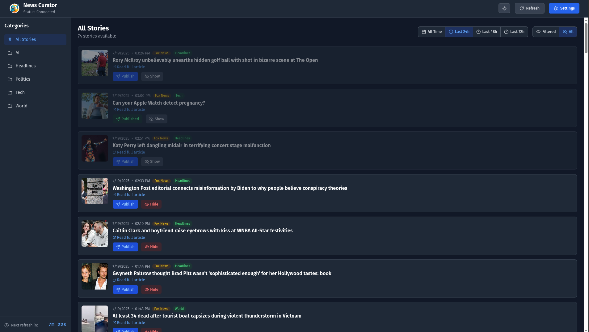
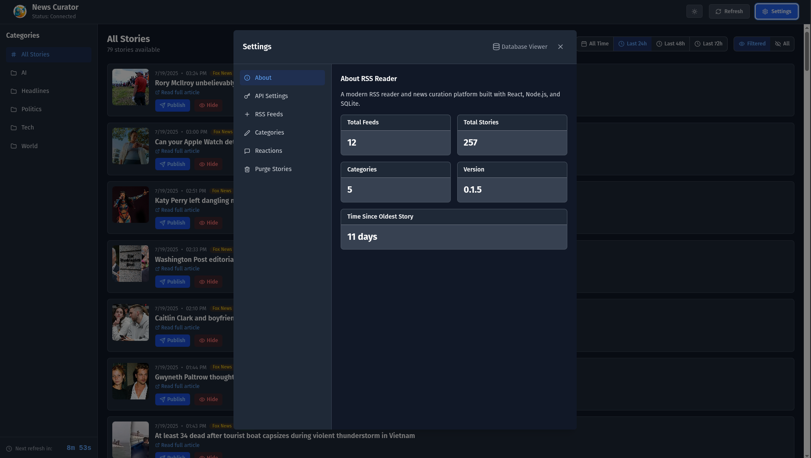
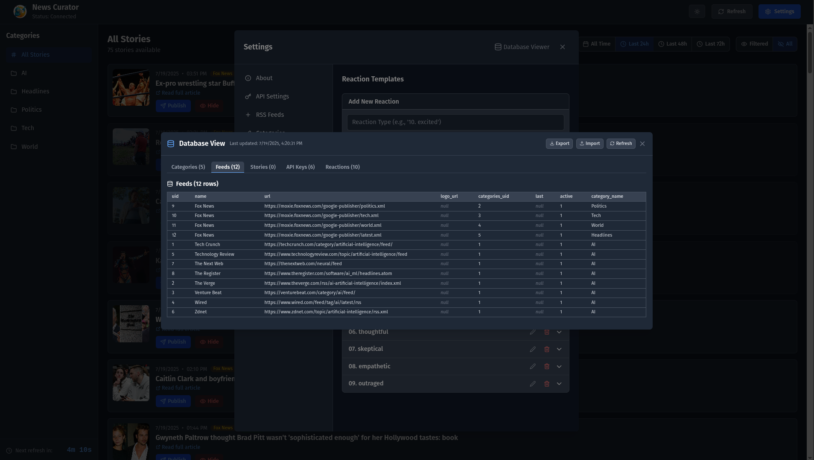
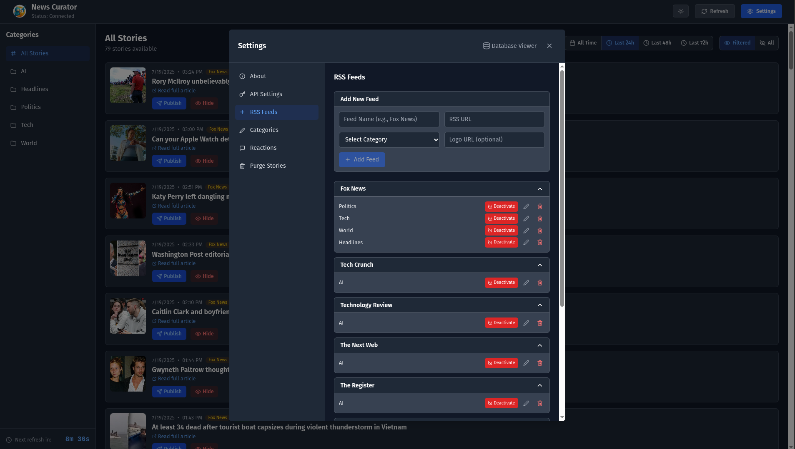
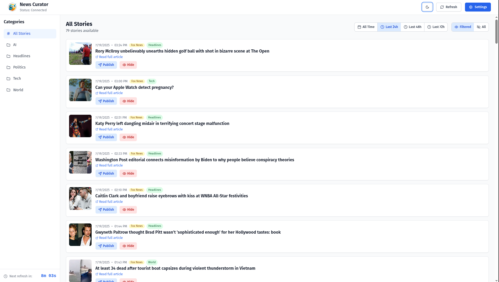
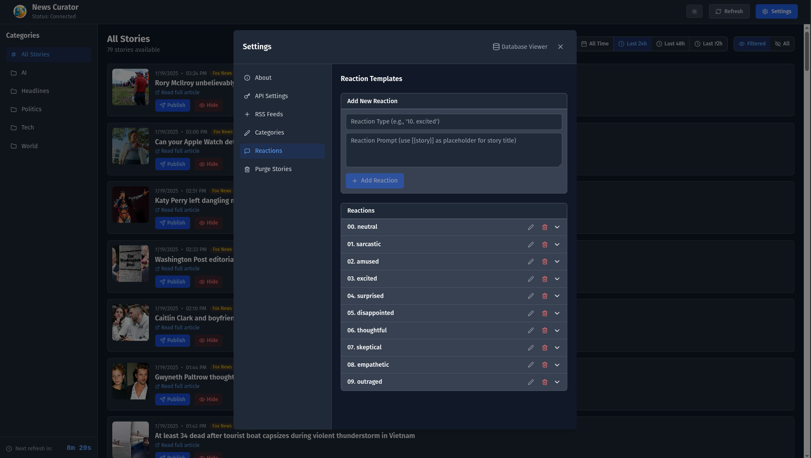

# 📰 News Curator - RSS Reader Application

A modern, full-featured RSS reader and news curation platform built with React, Node.js, and SQLite. Manage your news feeds, organize stories by categories, and curate content with an intuitive interface.

## ✨ Features

### 🔄 RSS Feed Management
- **Add Multiple Feeds**: Subscribe to any RSS/XML feed
- **Auto-Discovery**: Automatic feed validation and thumbnail extraction
- **Category Organization**: Organize feeds into custom categories
- **Active/Inactive Feeds**: Enable or disable feeds as needed
- **Feed Logos**: Support for custom feed logos and automatic favicon detection

### 📊 Story Curation
- **Smart Filtering**: Filter stories by date range (24h, 48h, 72h, or all time)
- **Visibility Control**: Show/hide stories from your main feed
- **Publication Status**: Mark stories as published for content curation
- **AI-Powered Publishing**: Generate reactions and publish stories with AI assistance
- **Publish Modal**: Interactive modal for story publishing with reaction generation
- **Thumbnail Support**: Automatic thumbnail extraction from article URLs
- **Real-time Updates**: Live updates via WebSocket connections

### 🎨 User Experience
- **Dark/Light Theme**: Toggle between dark and light modes
- **Responsive Design**: Works seamlessly on desktop and mobile
- **Real-time Countdown**: Shows time until next feed refresh
- **Connection Status**: Visual indicator of server connection status
- **Smooth Animations**: Polished UI with hover states and transitions

### 🔧 Advanced Features
- **Database Management**: Built-in database viewer with import/export functionality
- **Data Import/Export**: Complete database backup and restore capabilities
- **Story Purging**: Bulk delete stories by age, category, or source
- **API Key Management**: Secure configuration for AI and social media APIs
- **Reaction Templates**: Customizable AI reaction prompts for different tones
- **API Integration**: Support for AI and social media APIs
- **Automatic Polling**: Feeds refresh every 10 minutes automatically
- **Error Handling**: Robust error handling and recovery

### 📷 Screenshots

These screenshots showcase key features of the application.

| Published / Hidden | About | Database Viewer / Import / Export |
|-----------|-------|----------|
|  |  |  |
| *Main Interface* | *Settings -> About* | *Settings -> Database View Button* |

| Feeds | Light Mode | Reactions |
|-------|------------|-----------|
|  |  |  |
| *Settings -> Feeds Tab.* | *Light theme applied.* | *Settings -> Reactions* |

## 🚀 Quick Start

### Prerequisites
- Node.js 18+ 
- npm or yarn

### Installation

1. **Clone the repository**
   ```bash
   git clone <repository-url>
   cd rss-reader
   ```

2. **Install dependencies**
   ```bash
   npm install
   ```

3. **Start the application**
   ```bash
   npm run start
   ```

   > **⚠️ CRITICAL:** The server MUST be started before the webserver. If you need to restart the server, you must shut down the webserver first, then restart both services together using `npm run start`.

This will start both the backend server (port 3001) and frontend development server (port 5173).

### Alternative: Start servers separately

> **⚠️ WARNING:** When starting servers separately, always start the backend server first!

```bash
# Terminal 1 - Backend server
npm run server

# Terminal 2 - Frontend development server  
npm run dev
```

## 🏗️ Architecture

### Frontend (React + TypeScript)
- **React 18** with TypeScript for type safety
- **Tailwind CSS** for styling and responsive design
- **Lucide React** for consistent iconography
- **WebSocket client** for real-time updates

### Backend (Node.js + Express)
- **Express.js** server with WebSocket support
- **SQLite** database for data persistence
- **RSS Parser** for feed processing
- **CORS enabled** for cross-origin requests

### Database Schema
- **feeds** - RSS feed sources and metadata
- **categories** - Organization categories for feeds
- **stories** - Individual news articles/stories
- **api** - API keys and configuration

## 📱 Usage

### Adding RSS Feeds
1. Click the **Settings** button in the header
2. Go to the **RSS Feeds** tab
3. Fill in the feed details:
   - Feed Name (required)
   - RSS URL (required) 
   - Category (required)
   - Logo URL (optional)
4. Click **Add Feed**

### Managing Categories
1. Open **Settings** → **Categories** tab
2. Add new categories or edit existing ones
3. Categories help organize your feeds and stories

### Story Management
- **Hide/Show**: Toggle story visibility in your main feed
- **Publish**: Use the AI-powered publish modal to generate reactions and publish stories
- **Unpublish**: Revert published stories back to visible status
- **Filter by Date**: Use date range filters to focus on recent content
- **Filter by Visibility**: Show only visible stories or all stories

### API Configuration
Configure API keys for enhanced features:
- **XAI_API_KEY**: AI-powered content analysis
- **Twitter/X API Keys**: Social media integration
  - BEARER, CONSUMER_KEY, CONSUMER_SECRET
  - ACCESS_TOKEN, ACCESS_SECRET

### Database Management
- **Export Database**: Download complete database backup as JSON
- **Import Database**: Restore database from backup file
- **View Database**: Browse all tables and data in real-time
- **Purge Stories**: Bulk delete stories by various criteria

### Story Publishing Workflow
1. **Select Story**: Click "Publish" on any story card
2. **Choose Reaction**: Select from 10 different reaction types (neutral, sarcastic, excited, etc.)
3. **Generate Content**: AI generates human-like reactions with subtle humor
4. **Publish**: Story gets marked as published and hidden from main feed
5. **Unpublish**: Option to revert and make story visible again

## 🔧 Configuration

### Environment Variables
The application uses SQLite by default and doesn't require environment variables for basic operation. API keys are stored in the database and configured through the settings interface.

### Database Location
- SQLite database: `server/rss_reader.db`
- Automatic initialization on first run
- Built-in database viewer with import/export available in settings

## 📚 Documentation

Comprehensive documentation is available in the `/docs` directory:

- **[API Documentation](docs/api-documentation.md)** 📡 - Complete API reference
- **[Component Documentation](docs/components/README.md)** 🧩 - Frontend component guide
- **[API Tools Recommendations](docs/api-tools-recommendations.md)** 🛠️ - Development tools guide

### Component Documentation
- [Header Component](docs/components/Header.md) - Application header
- [StoryCard Component](docs/components/StoryCard.md) - Story display cards
- [PublishModal Component](docs/components/PublishModal.md) - Story publishing interface
- [SettingsModal Component](docs/components/SettingsModal.md) - Settings and configuration
- [Component Template](docs/component-documentation-template.md) - Documentation template

## 🛠️ Development

### Project Structure
```
├── src/                    # Frontend React application
│   ├── components/         # React components
│   │   ├── PublishModal.tsx    # Story publishing interface
│   │   ├── SettingsModal.tsx   # Settings and configuration
│   │   ├── DatabaseViewModal.tsx # Database management
│   │   └── ApiKeyWarningModal.tsx # API setup warnings
│   ├── hooks/             # Custom React hooks
│   └── main.tsx           # Application entry point
├── server/                # Backend Node.js server
│   ├── database.js        # SQLite database layer
│   ├── rssParser.js       # RSS feed parsing
│   ├── websocket.js       # WebSocket server
│   └── api endpoints      # Database import/export, thumbnails
│   └── server.js          # Express server
├── docs/                  # Documentation
└── package.json           # Dependencies and scripts
```

### Available Scripts
- `npm run dev` - Start frontend development server
- `npm run server` - Start backend server only
- `npm run start` - Start both frontend and backend
- `npm run build` - Build for production
- `npm run lint` - Run ESLint

### Technology Stack
- **Frontend**: React 18, TypeScript, Tailwind CSS, Vite
- **Backend**: Node.js, Express, WebSocket, SQLite
- **Tools**: ESLint, PostCSS, Autoprefixer

## 🔍 Features in Detail

### AI-Powered Story Publishing
The application includes a sophisticated publishing system:
- **10 Reaction Types**: From neutral to outraged, each with unique prompts
- **AI Content Generation**: Creates human-like reactions with subtle humor
- **Social Media Ready**: Generated content optimized for social platforms
- **Workflow Management**: Track published vs unpublished stories

### Database Management
Comprehensive database tools for power users:
- **Real-time Viewer**: Browse all database tables with live data
- **Export Functionality**: Download complete database as JSON backup
- **Import System**: Restore from backup with data validation
- **Purge Tools**: Bulk delete stories by age, category, or source

### Real-time Updates
The application uses WebSocket connections to provide real-time updates:
- New stories appear automatically when feeds are refreshed
- Story visibility and publication status sync across all clients
- Connection status indicator shows server connectivity

### Thumbnail Extraction
Automatic thumbnail extraction from article URLs:
- Supports Open Graph images
- Twitter card images
- Fallback to feed logos
- Caching to prevent duplicate requests

### Feed Polling
- Automatic feed refresh every 10 minutes
- Manual refresh available via header button
- Countdown timer shows time until next refresh
- Error handling for failed feed requests

### Settings Interface
Comprehensive settings modal with multiple tabs:
- **About**: Project information, statistics, and version details
- **API Settings**: Secure configuration for AI and social media APIs
- **RSS Feeds**: Add, edit, and manage feed sources
- **Categories**: Organize feeds into custom categories
- **Reactions**: Customize AI reaction prompts and types
- **Purge Stories**: Bulk delete tools with safety confirmations

## 🤝 Contributing

1. Fork the repository
2. Create a feature branch (`git checkout -b feature/amazing-feature`)
3. Commit your changes (`git commit -m 'Add amazing feature'`)
4. Push to the branch (`git push origin feature/amazing-feature`)
5. Open a Pull Request

## 📄 License

This project is licensed under the MIT License - see the LICENSE file for details.

## 🆘 Support

- 📖 Check the [documentation](docs/) for detailed guides
- 🐛 Report issues via GitHub Issues
- 💬 Join discussions in GitHub Discussions

---

**Built with ❤️ using React, Node.js, and modern web technologies**